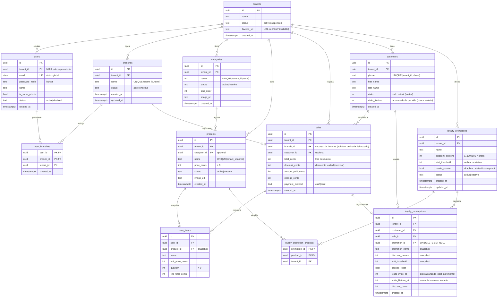

# Modelo ER — Faro (hasta migración 0012)

**Negocio único (ADR-007):** el sistema opera **un solo `tenants`** = el negocio. El super
admin (dueño global, `tenant_id NULL`, `is_super_admin`) lo administra vía
`businessTenantID()`; no pertenece a ninguna sucursal. Se conserva el esquema multi-tenant
(`tenant_id`) por mínimo cambio. Clientes y lealtad se comparten entre sucursales.

> **Sucursales (migraciones 0011 + 0012, ver ADR-006/ADR-007):** entra `branches` (capa
> organizativa) y `tenants` gana `favicon_url` (0011); `sales` gana `branch_id`. La sucursal
> del usuario es **M:N** vía `user_branches` (0012, reemplaza el `users.branch_id` único).
> El personal pertenece a 1+ sucursales; tras login elige su **sucursal activa** (claim en el
> JWT, `POST /auth/select-branch`), que etiqueta `sales.branch_id` (derivado en servidor) y el
> encabezado del POS (`Faro. {sucursal activa}`). Bucket "Sin sucursal" = `branch_id NULL`
> → reportes por sucursal. Administración de branches/favicon/usuarios: **solo super admin**.

> **v2 lealtad (migración 0010, ver ADR-005):** se pasa de config única a **promociones**.
> Se eliminan `loyalty_configs`, `loyalty_discount_products`, `loyalty_free_products`;
> entran `loyalty_promotions`, `loyalty_promotion_products`, `loyalty_redemptions`.
> `customers` gana `visits_lifetime`; `sales` pierde `loyalty_reward`.

## Reglas de negocio clave
- **Sucursales (ADR-006/ADR-007):** `branches` es una capa organizativa bajo el `tenants`
  único (`UNIQUE(tenant_id, name)`). El personal pertenece a **1+ sucursales** vía
  `user_branches` (M:N); el super admin las administra (solo super admin). Tras login, el
  usuario elige su **sucursal activa** (claim `activeBranchId` en el JWT, `POST
  /auth/select-branch`; auto si tiene 1). Esa sucursal etiqueta `sales.branch_id` **derivado
  en servidor** (NULL = "Sin sucursal") y el encabezado del POS (`Faro. {sucursal activa}`).
  `tenants.favicon_url` es el favicon por negocio (nullable → default). Coherencia
  branch↔tenant validada en servicio.
- **Lealtad por promociones** (visitas compartidas entre sucursales, ver ADR-005):
  `customers.visits` es el **contador de ciclo** y `customers.visits_lifetime` el acumulado
  de por vida. Cada venta pagada con cliente hace `visits += 1` y `visits_lifetime += 1`.
- Una **promoción** es aplicable cuando `visits ≥ visit_threshold`. El cajero aplica
  **manualmente una** promoción por venta; el servidor calcula `discount_cents` como
  `% × líneas de productos elegibles`, acotado al subtotal.
- Si la promoción tiene `resets_counter`, al aplicarla se escribe una fila en
  `loyalty_redemptions` (snapshot) y `visits → 0`; `visits_lifetime` no cambia.
- **Dinero** siempre en centavos (enteros).
- **Snapshot**: `sale_items` guarda `name`/`unit_price_cents`; `loyalty_redemptions` guarda
  el snapshot de la promoción al canjear.
