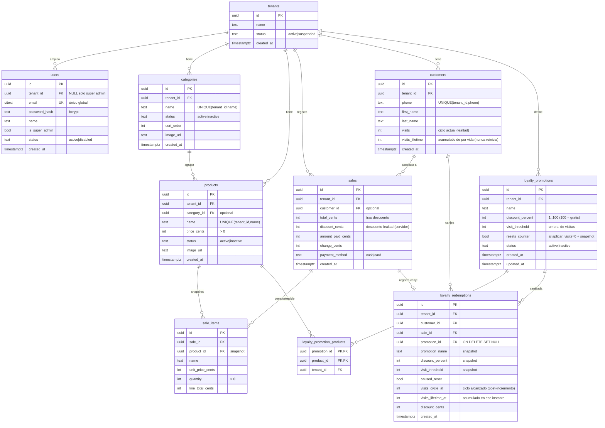

# Modelo ER — Faro (hasta migración 0010)

Multi-tenant: todo dato de negocio cuelga de `tenants`. El super admin global es un
`users` con `tenant_id NULL`. Clientes y lealtad son a nivel negocio → se comparten
entre sucursales automáticamente.

> **v2 lealtad (migración 0010, ver ADR-005):** se pasa de config única a **promociones**.
> Se eliminan `loyalty_configs`, `loyalty_discount_products`, `loyalty_free_products`;
> entran `loyalty_promotions`, `loyalty_promotion_products`, `loyalty_redemptions`.
> `customers` gana `visits_lifetime`; `sales` pierde `loyalty_reward`.

## Reglas de negocio clave
- **Lealtad por promociones** (visitas compartidas entre sucursales, ver ADR-005):
  `customers.visits` es el **contador de ciclo** y `customers.visits_lifetime` el acumulado
  de por vida. Cada venta pagada con cliente hace `visits += 1` y `visits_lifetime += 1`.
- Una **promoción** es aplicable cuando `visits ≥ visit_threshold`. El cajero aplica
  **manualmente una** promoción por venta; el servidor calcula `discount_cents` como
  `% × líneas de productos elegibles`, acotado al subtotal.
- Si la promoción tiene `resets_counter`, al aplicarla se escribe una fila en
  `loyalty_redemptions` (snapshot) y `visits → 0`; `visits_lifetime` no cambia.
- **Dinero** siempre en centavos (enteros).
- **Snapshot**: `sale_items` guarda `name`/`unit_price_cents`; `loyalty_redemptions` guarda
  el snapshot de la promoción al canjear.
