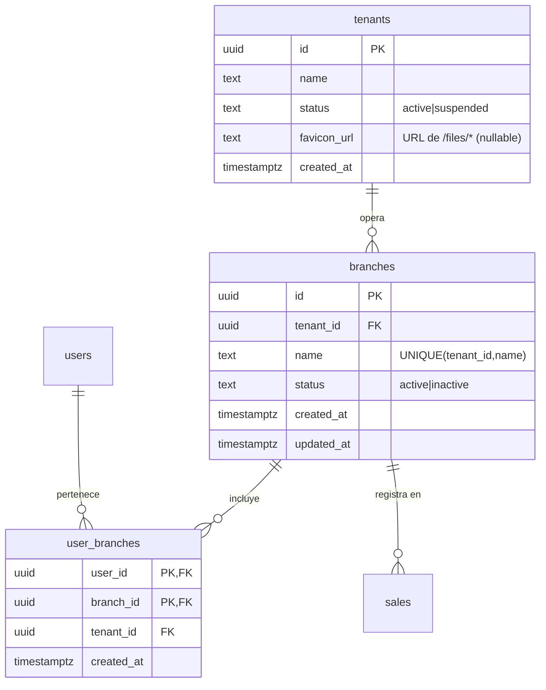

# Modelo de datos — M7 business-settings (branches + favicon)

_Fecha: 2026-07-02 (rev. 2026-07-03) · Migraciones: **0011_branches** + **0012_user_branches** · Decisiones: ADR-006 + **ADR-007**_

> **v2 (ADR-007, negocio único):** la sucursal del usuario deja de ser única
> (`users.branch_id`) y pasa a **M:N** (`user_branches`). Ver §5 (migración 0012). El resto
> de 0011 (tabla `branches`, `sales.branch_id`, `tenants.favicon_url`) se conserva.
> **Recomendación:** como 0011 aún no está implementada, lo más limpio es **no incluir
> `users.branch_id` en 0011** y crear directamente `user_branches` en 0012 (el backfill de
> §5 queda como no-op). Se documentan ambos caminos.

> Este documento es **diseño**. El DDL es la forma prevista; lo implementa
> backend-engineer como `migrations/0011_branches.{up,down}.sql`. Sigue las convenciones
> ya usadas (uuid PK `gen_random_uuid()`, `tenant_id` FK, `UNIQUE(tenant_id, name)`,
> índice por `tenant_id`, timestamps `timestamptz DEFAULT now()`).

## Cambios de esquema (0011) — orden del `up`

### 1. Tabla nueva `branches`

```sql
CREATE TABLE branches (
    id         uuid PRIMARY KEY DEFAULT gen_random_uuid(),
    tenant_id  uuid NOT NULL REFERENCES tenants(id),
    name       text NOT NULL,                        -- editable (ej. "Vanta Centro")
    status     text NOT NULL DEFAULT 'active',       -- active | inactive
    created_at timestamptz NOT NULL DEFAULT now(),
    updated_at timestamptz NOT NULL DEFAULT now(),
    CONSTRAINT branches_name_per_tenant UNIQUE (tenant_id, name)
);
CREATE INDEX branches_tenant_id_idx ON branches (tenant_id);
```

- **Unicidad de nombre por tenant** (como `categories`/`products`). Sensible a mayúsculas,
  por consistencia con el resto del sistema.
- **`status`** como ciclo de vida principal: `inactive` archiva la sucursal (deja de
  ofrecerse para asignar a usuarios) sin perder su nombre ni romper ventas históricas que
  la referencien.
- **`updated_at`** por consistencia con `loyalty_promotions` (nombre editable).

### 2. `users.branch_id` — ⚠️ **OBSOLETO (ADR-007)**, reemplazado por `user_branches` (M:N)

La propuesta original de 0011 (`ALTER TABLE users ADD COLUMN branch_id`) queda **anulada**:
la sucursal del usuario es ahora **M:N** (§5, migración 0012). **Si 0011 no se ha
implementado, omitir esta columna.** Si llegara a existir, 0012 la migra y la elimina.

### 3. `sales.branch_id` (sucursal de la venta)

```sql
ALTER TABLE sales ADD COLUMN branch_id uuid REFERENCES branches(id);
CREATE INDEX sales_branch_id_idx ON sales (branch_id);
```

- **Nullable:** `NULL` ⇒ venta "Sin sucursal".
- Se **deriva en servidor** desde la **sucursal activa de la sesión** (`activeBranchId` del
  JWT, ADR-007 §D5), no de `users.branch_id` ni del cliente. Un usuario operativo tiene
  sucursal activa; si no la hubiera, `POST /sales` responde `400 branch_required`.
- Índice para el **desglose/filtro por sucursal** en reportes. Considerar índice compuesto
  `(tenant_id, branch_id, created_at)` si el reporte por rango+sucursal lo requiere.

### 4. `tenants.favicon_url`

```sql
ALTER TABLE tenants ADD COLUMN favicon_url text;   -- NULL = sin favicon (usa el default)
```

- **Nullable**, sin default. Guarda una **URL relativa** de `POST /uploads`
  (ej. `/files/ab12.webp`), igual que `products.image_url`.
- **Por qué columna y no tabla de settings:** un único escalar tenant-level; KISS. Ver
  ADR-006 §D4 (deuda: migrar a `tenant_settings` si crecen los ajustes de marca).

## 5. Migración 0012 — `user_branches` (M:N) y retiro de `users.branch_id` (ADR-007)

```sql
-- 0012_user_branches (up): membresía M:N usuario↔sucursal.
CREATE TABLE user_branches (
    user_id    uuid NOT NULL REFERENCES users(id)    ON DELETE CASCADE,
    branch_id  uuid NOT NULL REFERENCES branches(id) ON DELETE CASCADE,
    tenant_id  uuid NOT NULL REFERENCES tenants(id),   -- denormalizado (aislamiento)
    created_at timestamptz NOT NULL DEFAULT now(),
    PRIMARY KEY (user_id, branch_id)
);
CREATE INDEX user_branches_branch_id_idx ON user_branches (branch_id);
CREATE INDEX user_branches_tenant_id_idx ON user_branches (tenant_id);

-- Backfill desde 0011 SOLO si users.branch_id existe con datos (no-op si se omitió en 0011):
INSERT INTO user_branches (user_id, branch_id, tenant_id)
SELECT id, branch_id, tenant_id FROM users WHERE branch_id IS NOT NULL;

-- Retirar la asignación única de 0011:
DROP INDEX IF EXISTS users_branch_id_idx;
ALTER TABLE users DROP COLUMN IF EXISTS branch_id;
```

- **Sin `status`/rol en la membresía:** M:N pura (pertenencia). Un eventual rol por sucursal
  (owner/barista) sería una columna/tabla futura → **pregunta abierta P1** (roles).
- **Aislamiento:** `tenant_id` denormalizado como en `loyalty_promotion_products`; el
  servicio valida `branch.tenant_id == businessTenantID()` al asignar.
- `down (0012)`: `ALTER TABLE users ADD COLUMN branch_id uuid REFERENCES branches(id)`,
  backfill con una sucursal por usuario (ej. `min(branch_id)`), `DROP TABLE user_branches`.

## `down` (revertir 0011)
```sql
DROP INDEX sales_branch_id_idx;   ALTER TABLE sales DROP COLUMN branch_id;
-- (users.branch_id ya no existe si se aplicó 0012 / se omitió en 0011)
ALTER TABLE tenants DROP COLUMN favicon_url;
DROP TABLE branches;   -- tras soltar las FK anteriores
```
No hay pérdida de datos preexistentes (todo lo que se elimina es nuevo de 0011); se pierde
la atribución de sucursal de las ventas registradas mientras estuvo viva.

## ER (fragmento) — integrado en `.arete/db/er.md`



## Aislamiento
- `branches`/`settings`/`user_branches` acotadas al **tenant del negocio** (`businessTenantID()`
  para el super admin; `tenantOf` para el resto). Ver ADR-007 §D2.
- Al asignar membresías o derivar `sales.branch_id`, el servicio verifica que la branch
  pertenezca al tenant del negocio.

## Fuera de alcance de 0011 (futuro)
- Atributos de sucursal (dirección, teléfono, horario, `sort_order`, logo propio).
- FK compuesta `(tenant_id, branch_id)` como barrera dura de aislamiento.
- Roles/permisos para restringir quién administra sucursales.
